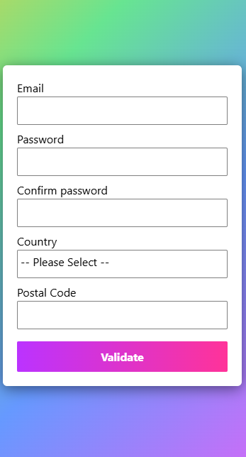

## 🛡️ Advanced Form Validation

This is a responsive, animated registration form built with **vanilla JavaScript**, **HTML5**, and **CSS3**. The form includes **client-side validation** for key fields such as email, password, country selection, and postal code formatting — with live feedback, password strength indicators, and a celebratory message when validation succeeds.

---

### ✨ Features

* 📩 **Email Validation**

* 🔒 **Secure Password Validation**
  Enforces strong password rules:

  * At least 8 characters
  * 1 uppercase letter
  * 1 number
  * 1 special character
    Live UI indicators update as you type.

* ✅ **Confirm Password Match**
  Ensures that the password and confirmation fields are identical.

* 🌍 **Country-Specific Postal Code Validation**
  Postal code format dynamically adjusts based on the selected country (e.g., Nigeria, Switzerland, Germany, etc.).

* 📲 **Responsive Design**
  Styled with animated gradient backgrounds and modern UI/UX principles.

* 🎉 **Success Animation**
  Upon successful submission, a slide-in celebratory screen (**enhanced with fun GIFs**) confirms form completion.

---

### 🖼️ Screenshots

1. Main form UI
   .png)
2. Password rules with error messages
   .png)
3. Country selection with postal code validation
   .png)
4. Success message with celebratory GIF
   
5. Mobile layout view
   

---

### 🔗 Resources & Attribution

* **CSS Reset** by Josh W. Comeau:
  [Custom CSS Reset](https://www.joshwcomeau.com/css/custom-css-reset/)

* **Tenor GIFs for Success Animation**:

  > GIFs powered by [Tenor](https://tenor.com)

